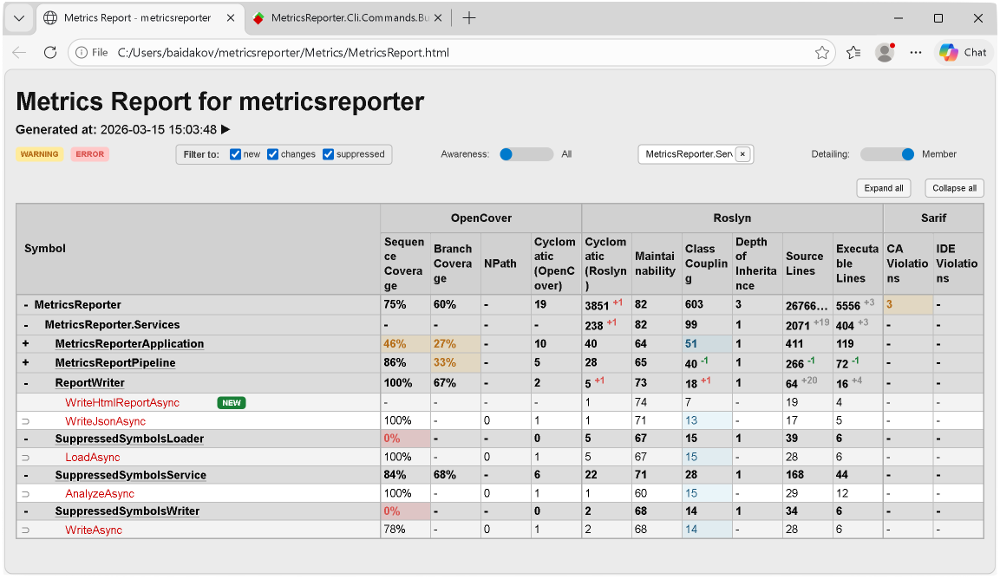
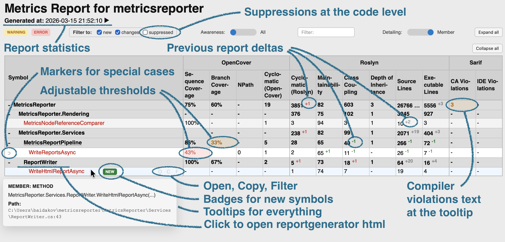
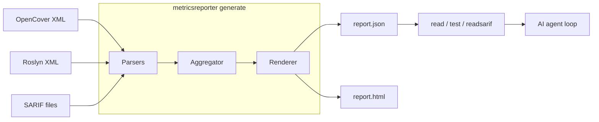

<p align="center">
  <h1 align="center">MetricsReporter</h1>
  <p align="center">
    <b>Three data sources. One dashboard. Measurable improvement.</b>
  </p>
</p>

<p align="center">
  <a href="https://github.com/baidakovil/metricsreporter/actions/workflows/ci.yml"></a>
  <a href="https://www.nuget.org/packages/MetricsReporter.Tool"></a>
  <a href="https://github.com/baidakovil/metricsreporter/blob/master/LICENSE"></a>
  <a href="https://dotnet.microsoft.com/"></a>

</p>
<p align="center">
  <a href="https://codecov.io/gh/baidakovil/metricsreporter"></a>
  
  
</p>

---

**MetricsReporter** is a .NET 8 CLI tool that aggregates code coverage, complexity, coupling, and analyzer violations from three independent sources into one interactive dashboard — then lets you (or your AI agent) fix everything via a structured refactoring loop.

```
  coverage.xml  +  metrics.xml  +  violations.sarif   →   one interactive HTML dashboard
  (OpenCover,       (Roslyn)        (Analyzers)              + unified JSON
   AltCover,
   etc)
```

<p align="center">
  
  <br>
  <sub><a href="https://baidakovil.github.io/metricsreporter/docs/samples/MetricsReport.html">▶ Open live interactive demo</a></sub>
</p>

## The Problem

Your C# project has growing tech debt, but:

- **Coverage, metrics, and violations live in three separate files** — OpenCover XML, Roslyn XML, and SARIF JSON
- **No single view** shows coupling, complexity, coverage, and analyzer violations together
- **You can't measure** whether a refactoring actually helped
- **AI agents don't know** which method to fix first or whether the fix worked

## Quick Start

```powershell
# Install
dotnet tool install --global MetricsReporter.Tool

# Generate dashboard from your three data sources
metricsreporter generate --opencover coverage.xml --roslyn metrics.xml --sarif analyzers.sarif --output-html report.html

# Query violations from CLI — returns JSON
metricsreporter read --namespace MyApp.Services --metric Coupling
# → [{"kind":"Type","fullyQualifiedName":"MyApp.Services.OrderService","metrics":{"RoslynClassCoupling":{"value":14,"status":"Warning"}}}]

# Verify a fix passes thresholds
metricsreporter test --symbol MyApp.Services.OrderService.Process --metric Complexity
# → {"isOk":true}
```

Open `report.html` — you'll see the dashboard from the screenshot above.

> **Next step →** [Full tutorial: produce your first dashboard](docs/1-tutorials/1.1%20-%20first-metrics-run.md) · [CLI reference](docs/3-reference/3.2%20-%20metricsreporter-cli.md) · [Configuration reference](docs/3-reference/3.1%20-%20configuration-options.md)

## Key Features

**[Interactive HTML Dashboard](docs/README.md#the-dashboard)** — Drill down from Solution → Assembly → Namespace → Type → Method. Filter instantly, toggle warning/error awareness, hover for metric details. Self-contained HTML, no server, handles 50k+ symbols.

**[AI-Driven Refactoring](#ai-agent-workflow)** — Give any AI agent (Copilot, Cursor, Claude) a namespace and a metric. It reads the violation, edits the code, rebuilds, and verifies — autonomously. Ready-to-use prompt files included.

**[Threshold Gates for CI](docs/README.md#threshold-configuration)** — Define warning/error thresholds per metric per symbol level. CLI exits with `0` (pass) or non-zero (fail) — plug it straight into your pipeline.

**[Baseline & Delta Tracking](docs/README.md#baseline--delta-tracking)** — Every run saves a baseline. Next run computes deltas automatically, per method — complexity, coverage, violations.

**[Suppression System](docs/README.md#suppression-system)** — Mark intentional exceptions with `[SuppressMessage]`. They show up in the dashboard with justifications, not as false alarms. ([full reference](docs/3-reference/3.4%20-%20suppression-guidelines.md))

**[ReportGenerator Integration](docs/README.md#reportgenerator-integration)** — Link to line-by-line HTML coverage maps. Script hooks trigger full rebuild + coverage recollection as part of the AI verify step.

> **All features →** [Feature deep dive](docs/README.md)

<p align="center">
  
  <br>
  <sub>Rich interactive UI — adjustable thresholds, delta tracking, suppressions, tooltips, ReportGenerator deep links, and more</sub>
</p>

<h2 id="ai-agent-workflow">AI Agent Workflow</h2>

MetricsReporter ships with ready-to-use prompt files for Copilot, Cursor, or any AI agent:

```powershell
# 1. Agent asks: "what's broken?"
metricsreporter read --namespace MyApp.Services --metric Coupling

# 2. Agent reads the source, edits files, runs `dotnet build`

# 3. Agent verifies the fix:
metricsreporter test --symbol MyApp.Services.OrderProcessor --metric Coupling
# → { "isOk": true }  ✅

# 4. Repeat until clean
```

| Prompt file | What the agent does |
|-------------|-------------------|
| [`refactor-complexity.md`](Metrics/Agent/refactor-complexity.md) | Reduce cyclomatic complexity below thresholds |
| [`refactor-coupling.md`](Metrics/Agent/refactor-coupling.md) | Reduce class coupling with DI, interfaces, DTOs |
| [`refactor-coverage.md`](Metrics/Agent/refactor-coverage.md) | Write tests until branch coverage passes |
| [`refactor-sarif.md`](Metrics/Agent/refactor-sarif.md) | Fix CA/IDE analyzer violations |


## Technical Highlights

- **Cross-format symbol resolution** — cross-links symbols across three unrelated XML/JSON formats by fully-qualified name, handling compiler-generated state machines and namespace mismatches ([details](docs/4-explanation/4.3%20-%20namespace-inference.md))
- **Clean architecture** — command handlers, dependency injection, interface segregation, NUnit + NSubstitute test suite
- **Zero-dependency HTML** — renders 50k+ symbols with vanilla JS, no frameworks, no CDN — one self-contained file
- **Three-layer configuration** — CLI flags → env vars → JSON config → defaults, with JSON schema validation ([reference](docs/3-reference/3.1%20-%20configuration-options.md))
- **Structured CLI** — four commands (`generate`, `read`, `readsarif`, `test`) with JSON output to stdout — designed for both human and machine consumption

## Architecture



| Layer | Key classes | Responsibility |
|-------|-------------|----------------|
| **Parsers** | `OpenCoverMetricsParser`, `RoslynMetricsParser`, `SarifMetricsParser` | Parse each format into a unified symbol model |
| **Aggregator** | `MetricsAggregationService` | Merge into `Solution→Assembly→Namespace→Type→Member` tree, apply thresholds, compute deltas |
| **Renderer** | `NodeHierarchyRenderer`, `MetricValueRenderer` | Serialize queryable JSON + self-contained HTML |
| **CLI** | `CommandHandler<TOptions>` | Four commands backed by DI-composed pipeline |

→ [Architecture deep dive](docs/4-explanation/4.1%20-%20architecture-and-pipeline.md)

## Who Is This For

- **Solo developers** tracking tech debt across coverage, complexity, and violations in one place
- **Teams** enforcing quality gates in CI with threshold-based exit codes
- **AI agent operators** running autonomous refactoring loops — no API keys, no servers, just CLI

## Documentation

| | |
|---|---|
| **[Tutorials](docs/1-tutorials/1.0%20-%20README.md)** | Get your first dashboard running |
| **[How-To Guides](docs/2-how-to-guides/2.0%20-%20README.md)** | Config files, scripts, shipping updates |
| **[Reference](docs/3-reference/3.0%20-%20README.md)** | CLI commands, config schema, report format, suppressions |
| **[Explanation](docs/4-explanation/4.0%20-%20README.md)** | Architecture, coverage pipeline, namespace inference |
| **[Feature Deep Dive](docs/README.md)** | Dashboard, AI integration, suppressions, reconciliation engine |

## Contributing

```powershell
git clone https://github.com/baidakovil/metricsreporter.git
cd metricsreporter
dotnet restore && dotnet build && dotnet test
```

The project follows SOLID principles, uses DI throughout, and maintains a comprehensive NUnit test suite. See [CONTRIBUTING.md](CONTRIBUTING.md) for code style, branch workflow, and PR guidelines.

## License

[MIT](LICENSE)

