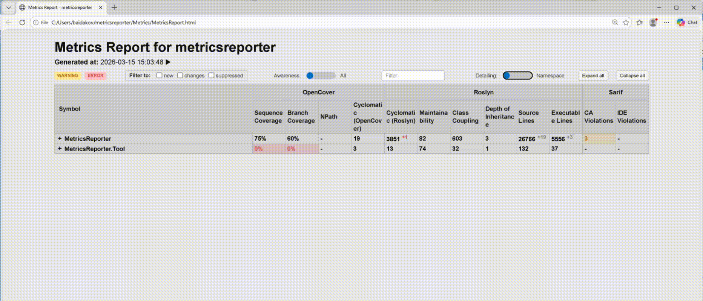
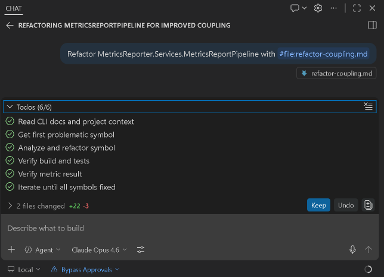
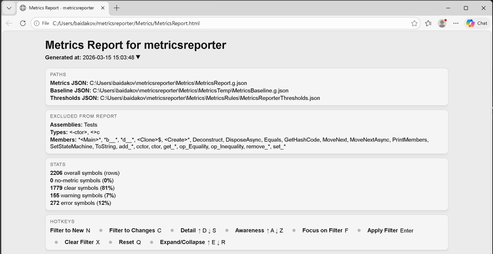
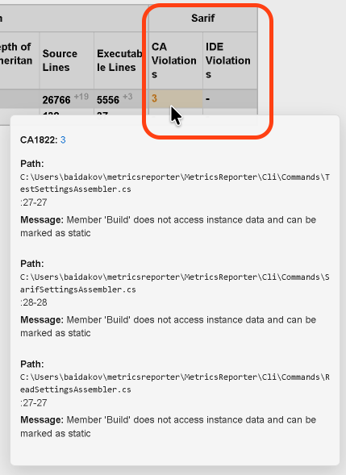
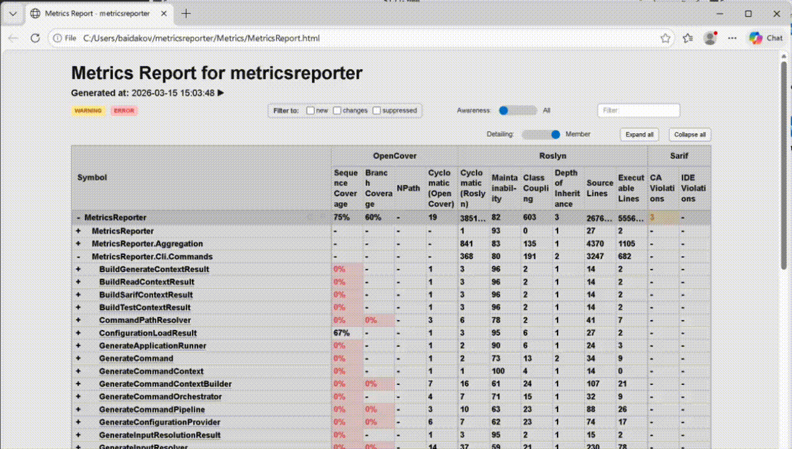
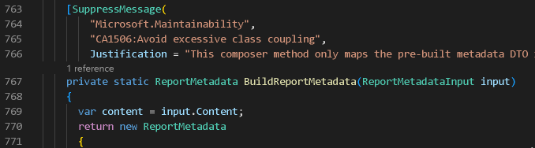
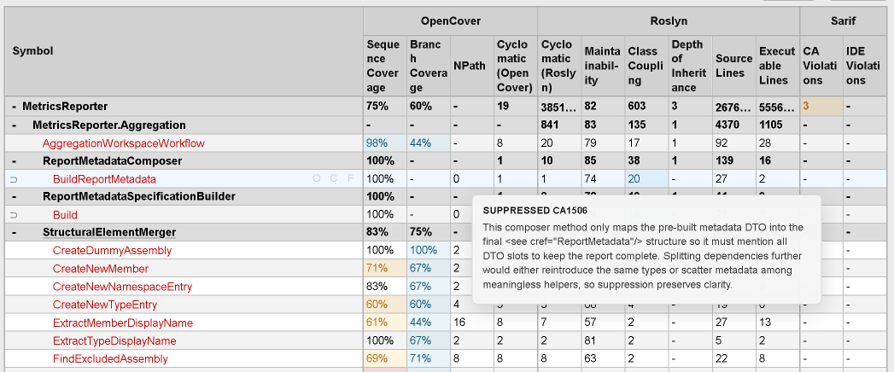
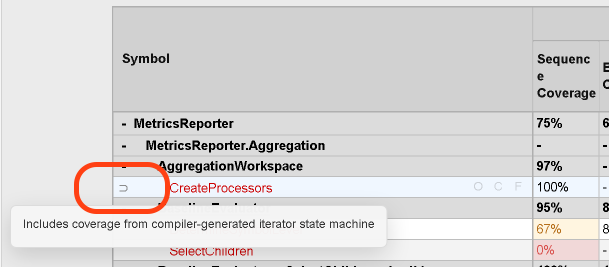

<p align="center">
  <h1 align="center">MetricsReporter</h1>
  <p align="center">
    <b>Turn your C# chaos into Coupling&nbsp;&lt;&nbsp;5 and Complexity&nbsp;&lt;&nbsp;15. In one prompt. Measurably.</b>
  </p>
</p>

<p align="center">
  <a href="https://github.com/baidakovil/metricsreporter/blob/main/LICENSE"></a>
  <a href="https://dotnet.microsoft.com/"></a>
  <a href="#install"></a>
  <a href="#ai-driven-refactoring"></a>
</p>

---

**MetricsReporter** is a .NET 8 CLI tool that aggregates code coverage, complexity, coupling, and analyzer violations from **four independent sources** into one interactive dashboard — then lets you (or your AI agent) fix everything via a structured refactoring loop.

<p align="center">
  
</p>

## The problem

Your C# project has growing tech debt. You *feel* the code is getting worse, but:

- **Coverage data** lives in OpenCover XML, Roslyn metrics are in a separate XML, SARIF violations in yet another file
- **No single dashboard** shows coupling, complexity, coverage, and analyzer violations together
- **You can't measure** whether a refactoring actually helped
- **AI agents don't know** which method to fix first or whether the fix worked

## The solution

```
One command. Four sources. One dashboard. Measurable improvement.
```

MetricsReporter merges **OpenCover** (coverage), **Roslyn** (complexity & coupling), and **SARIF** (analyzer violations) into a unified report. Then it gives your AI coding agent a CLI to query, refactor, verify — in a loop — until every metric is green.

## Key Features

### AI-Driven Refactoring

Hand your AI agent a namespace and a metric. It reads the violation, studies the code, refactors, rebuilds, verifies — all through the CLI. No human in the loop.

```powershell
# AI agent asks: "what's broken?"
metricsreporter read --namespace MyApp.Services --metric Coupling --symbol-kind Any

# AI agent fixes the code, rebuilds, then verifies:
metricsreporter test --symbol MyApp.Services.OrderProcessor --metric Coupling
# → { "isOk": true }  ✅
```

<p align="center">
  
  <br>
  <sub>Built-in refactoring prompts for complexity, coupling, and coverage — ready for Copilot, Cursor, or any AI agent</sub>
</p>

> **Cover 1,000 lines of code with tests. Automatically.**
>
> The coverage workflow reads violations, writes NUnit tests with mocks, runs them, collects coverage, and verifies — until every branch is green.

### Interactive HTML Dashboard

Drill down from Solution to Assembly to Namespace to Type to Method. Filter instantly, toggle warning/error awareness, hover for metric details. No frameworks — pure JS, handles 50k+ symbols.

<p align="center">
  
  <br>
  <sub>Aggregate statistics at a glance — coverage %, complexity distribution, violation counts</sub>
</p>

### SARIF Violations with Breakdown

See exactly which CA/IDE rules fire at each level. Hover for rule descriptions, file paths, and line numbers.

<p align="center">
  
  <br>
  <sub>Hover any SARIF metric to see rule-by-rule breakdown with source locations</sub>
</p>

### ReportGenerator Integration

Seamless integration with [ReportGenerator](https://github.com/danielpalme/ReportGenerator) for interactive, line-by-line coverage visualization alongside your metrics dashboard.

<p align="center">
  
  <br>
  <sub>Line-by-line coverage maps powered by ReportGenerator, launched alongside MetricsReporter</sub>
</p>

### Suppression System

Not every violation should be fixed. Mark intentional exceptions with `[SuppressMessage]` — they show up in the dashboard with justifications, not as false alarms.

<p align="center">
  &nbsp;&nbsp;
  
  <br>
  <sub>Left: suppression attribute in code &nbsp;|&nbsp; Right: suppression reflected in dashboard with justification tooltip</sub>
</p>

### Baseline & Delta Tracking

Every run saves a baseline. Next run computes deltas automatically. You see whether complexity went up or down, whether coverage improved, whether new violations appeared — per method.

### Threshold Gates for CI

Define warning/error thresholds per metric per level. CLI exits with code `0` (pass) or non-zero (fail) — plug it straight into your pipeline.

```json
{
  "RoslynClassCoupling": {
    "Type":   { "warning": 20, "error": 40 },
    "Member": { "warning": 5,  "error": 11 }
  },
  "RoslynCyclomaticComplexity": {
    "Type":   { "warning": 15, "error": 100 },
    "Member": { "warning": 15, "error": 100 }
  }
}
```

### Smart Reconciliation

OpenCover assigns coverage to compiler-generated state machines (`<Method>d__0`). Roslyn lacks namespace data. MetricsReporter handles all of this — iterator coverage gets transferred back to real methods, namespaces are inferred, duplicates are detected.

<p align="center">
  
  <br>
  <sub>Iterator state machine coverage automatically attributed to the real method</sub>
</p>

---

<h2 id="install">Quick Start</h2>

### Install

```powershell
dotnet tool install --global MetricsReporter.Tool
```

### Generate your first report

```powershell
metricsreporter generate `
  --opencover coverage.xml `
  --roslyn metrics.xml `
  --sarif analyzers.sarif `
  --output-json report.json `
  --output-html report.html `
  --thresholds-file thresholds.json
```

### Or use config-driven mode

Create `.metricsreporter.json` in your repo root ([configuration reference](docs/3-reference/3.1%20-%20configuration-options.md)):

```json
{
  "metricsDir": "Metrics",
  "openCover": ["Metrics/OpenCover/coverage.xml"],
  "roslyn": ["Metrics/Roslyn/SolutionMetrics.g.xml"],
  "sarif": ["Metrics/Sarif/ca.sarif"],
  "outputJson": "Metrics/MetricsReport.g.json",
  "outputHtml": "Metrics/MetricsReport.html",
  "thresholdsFile": "Metrics/MetricsRules/MetricsReporterThresholds.json"
}
```

Then just:

```powershell
metricsreporter generate
```

### Query metrics from CLI

```powershell
# Find first coupling violation in a namespace
metricsreporter read --namespace MyApp.Services --metric Coupling

# Verify a specific symbol passes thresholds
metricsreporter test --symbol MyApp.Services.OrderService.Process --metric Complexity

# List all coverage violations, grouped by type
metricsreporter read --namespace MyApp --metric OpenCoverBranchCoverage --group-by type
```

---

<h2 id="ai-driven-refactoring">AI Agent Workflow</h2>

MetricsReporter ships with ready-to-use prompt files for AI agents:

| Prompt | What the agent does |
|--------|-------------------|
| [`refactor-complexity.md`](Metrics/Agent/refactor-complexity.md) | Reduce cyclomatic complexity below thresholds |
| [`refactor-coupling.md`](Metrics/Agent/refactor-coupling.md) | Reduce class coupling with DI, interfaces, DTOs |
| [`refactor-coverage.md`](Metrics/Agent/refactor-coverage.md) | Write tests until branch coverage passes |
| [`refactor-sarif.md`](Metrics/Agent/refactor-sarif.md) | Fix CA/IDE analyzer violations |

**The loop is simple:**

```
1. metricsreporter read  → find violation
2. Study code            → plan refactoring
3. Refactor + build      → apply changes
4. metricsreporter test  → verify fix
5. Repeat until clean
```

The agent works autonomously — no human input needed between steps.

---

## Metrics Sources

| Source | Metrics |
|--------|---------|
| **OpenCover** | Sequence Coverage, Branch Coverage, Cyclomatic Complexity, NPath Complexity |
| **Roslyn** | Maintainability Index, Cyclomatic Complexity, Class Coupling, Depth of Inheritance, Lines of Code |
| **SARIF** | CA-prefix (FxCop), IDE-prefix analyzer violations with rule-level breakdown |

---

## Documentation

Full [Diataxis-structured documentation](docs/README.md):

- **[Tutorials](docs/1-tutorials/1.0%20-%20README.md)** — Get your first dashboard running
- **[How-To Guides](docs/2-how-to-guides/2.0%20-%20README.md)** — Config files, scripts, shipping updates
- **[Reference](docs/3-reference/3.0%20-%20README.md)** — CLI commands, config schema, report format, suppressions
- **[Explanation](docs/4-explanation/4.0%20-%20README.md)** — Architecture, coverage pipeline, namespace inference

---

## Contributing

```powershell
git clone https://github.com/baidakovil/metricsreporter.git
cd metricsreporter
dotnet restore && dotnet build && dotnet test
```

See [running from source](docs/2-how-to-guides/2.1%20-%20run-from-source.md) for development workflow.

## License

[MIT](LICENSE)

